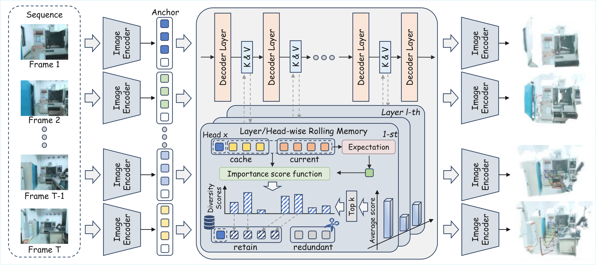

<div align="center">
<h1>InfiniteVGGT: Visual Geometry Grounded Transformer for Endless Streams</h1>
</div>

<div align="center">
    <p>
        <a>
            
        </a>
        &nbsp;&nbsp;
        <a href="https://github.com/Henryyuan429">Shuai Yuan,</a><sup>1</sup>&nbsp;&nbsp;
        <a href="https://github.com/YantaiYang-05">Yantai Yang,</a><sup>1, 2</sup>&nbsp;&nbsp;
        <a>Xiaotian Yang,</a><sup>1</sup>&nbsp;&nbsp;
        <a>Xupeng Zhang,</a><sup>1</sup>&nbsp;&nbsp;
        <br>
        <a>Zhonghao Zhao,</a><sup>1</sup>&nbsp;&nbsp;
        <a>Lingming Zhang,</a><sup></sup>&nbsp;&nbsp;
        <a href="https://zhipengzhang.cn/">Zhipeng Zhang</a><sup>1 ✉</sup>&nbsp;&nbsp;
    </p>
     <p>
        <sup>1</sup><a>AutoLab, School of Artificial Intelligence, Shanghai Jiao Tong University</a>&nbsp;&nbsp;
        <br>
        <sup>2</sup><a>Anyverse Dynamics</a>
    </p>
    <p>
        <sup>✉</sup> Corresponding Author
    </p>
</div>

<p align="center">
    <a href="https://arxiv.org/abs/2601.02281v1"></a>
    <a href="https://huggingface.co/papers/2601.02281"></a>


<p align="center">

</p>
<p>
    <i> Achieving higher reconstruction quality and more accurate camera pose estimation using thousands of frames input.</i>
</p>

## 📰 News
- [Jan 6 , 2026] Paper release.
- [Jan 6 , 2026] Code release.


## 📖 Overview
We propose **InfiniteVGGT**, a causal visual geometry transformer that utilizes a training-free rolling memory mechanism to enable stable, infinite-horizon streaming, and introduce the **Long3D** benchmark to rigorously evaluate long-term continuous 3D geometry performance.
Our main contributions are summarized as follows:

1. An unbounded memory architecture \mymethod{} for continuous 3D geometry understanding, built on a novel, dynamic, and interpretable explicit memory system.
2. State-of-the-art performance on long-sequence benchmarks and a unique capability for robust, infinite-horizon reconstruction without memory overflow.
3. The Long3D benchmark, a new dataset for the rigorous evaluation of long-term performance, addressing a critical gap in the field.

<div align="center">
    <a>
        
    </a>
</div>


## 🌍 Installation

1. Clone InfiniteVGGT
```bash
git clone https://github.com/AutoLab-SAI-SJTU/InfiniteVGGT.git
cd InfiniteVGGT
```
2. Create conda environment
```bash
conda create -n infinitevggt python=3.11 cmake=3.14.0
conda activate infinitevggt 
```

3. Install requirements
```bash
pip install -r requirements.txt
conda install 'llvm-openmp<16'
```

4. Download the StreamVGGT pretrained [checkpoint](https://huggingface.co/lch01/StreamVGGT) and place it to ./ckpt directory.


## ▶️ Run Inference
```bash
# Run on your own data
python run_inference.py --input_dir path/to/your/images_dir

# Run long sequence and store the result to directory for each frame
python run_inference.py \
    --input_dir path/to/your/images_dir \
    --frame_cache_dir path/to/your/results_perframe_dir \
    --no_cache_results
```

## 🚀 Run Demo
We provide demo code based on the [NRGBD](https://github.com/dazinovic/neural-rgbd-surface-reconstruction) dataset. You can run it using the following command:

```bash
python demo_viser.py  \
    --seq_path path/to/nrgbd/image_sequence \
    --frame_interval 10 \
    --gt_path path/to/nrgbd/gt_camera \ (Optional)
```

## 📋 Checklist
- [ ] Release the Dataset.

## 🙏 Acknowledgement
We would like to acknowledge the following open-source projects that served as a foundation for our implementation:

[DUSt3R](https://github.com/naver/dust3r)
[CUT3R](https://github.com/CUT3R/CUT3R)
[VGGT](https://github.com/facebookresearch/vggt)
[Point3R](https://github.com/YkiWu/Point3R)
[StreamVGGT](https://github.com/wzzheng/StreamVGGT)
[FastVGGT](https://github.com/mystorm16/FastVGGT)
[TTT3R](https://github.com/Inception3D/TTT3R)

Many thanks to these authors!

## 📜 Citation

If you incorporate our work into your research, please cite:
```
@misc{yuan2026infinitevggt,
        title={InfiniteVGGT: Visual Geometry Grounded Transformer for Endless Streams}, 
        author={Shuai Yuan and Yantai Yang and Xiaotian Yang and Xupeng Zhang and Zhonghao Zhao and Lingming Zhang and Zhipeng Zhang},
        journal={arXiv preprint arXiv:2601.02281},
        year={2026}
}
```
